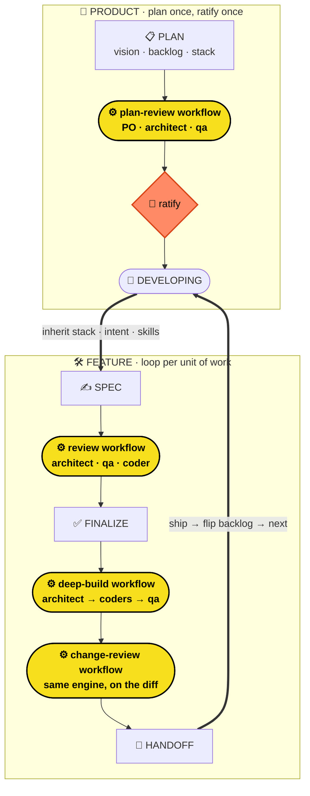
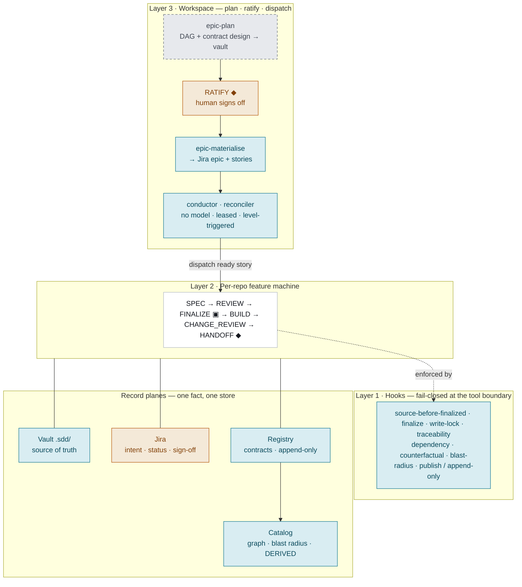
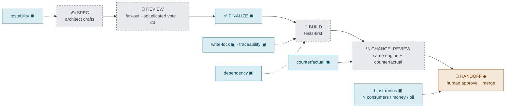
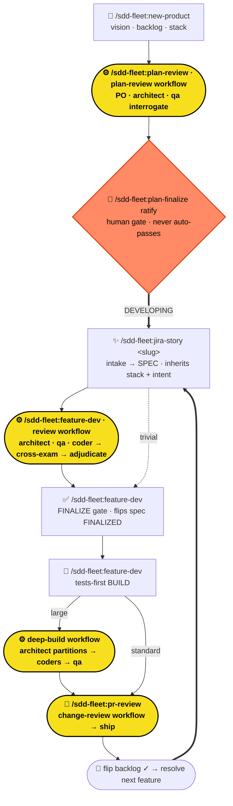
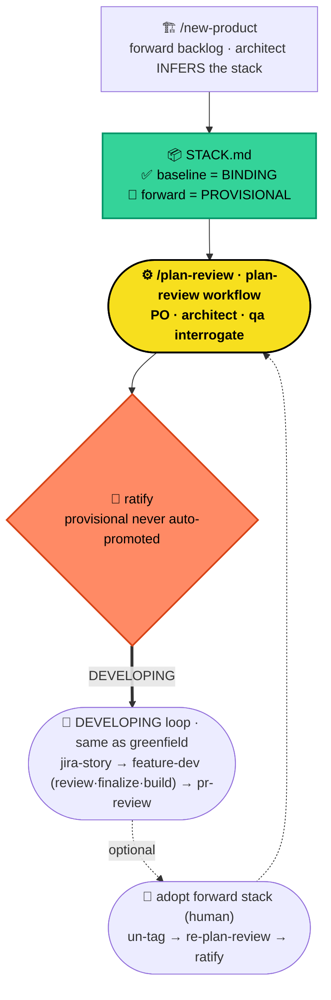
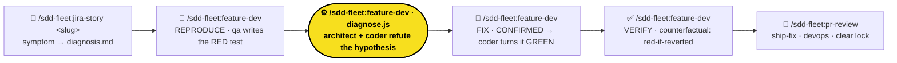
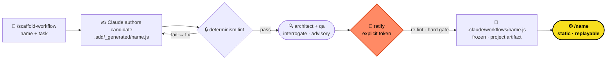

# sdd-fleet

A spec-driven multi-agent software house, packaged as a Claude Code plugin.
**v1.1.0**

sdd-fleet turns Claude Code into a disciplined software house. A fleet of role
subagents drives every change through a deterministic state machine —
**SPEC → REVIEW → FINALIZE → BUILD → CHANGE_REVIEW → HANDOFF** — with phase gates
enforced by hooks, not vibes. No source is written until the spec is FINALIZED;
no handoff until tests pass and the change is reviewed.

**A product tier sits *above* the per-feature loop.** A product is planned
once — vision, a phased backlog, and a single binding **stack-of-record** — then
**ratified by a human**, and every feature thereafter *inherits* that stack and
its own one-line intent. The result is two nested cycles: a **PLAN** machine for
the product, and the **per-feature** machine for each unit of work, joined by a
**DEVELOPING loop** that advances the backlog one ratified feature at a time.

The pillars:

- **Product tier** — `/sdd-fleet:new-product` scaffolds `.sdd/_product/`
  (vision, backlog, stack, ADRs). Greenfield **ratifies** a fresh stack;
  brownfield **infers** the actual stack from code as a binding baseline.
- **PLAN machine** — `PLAN → PLAN_REVIEW → PLAN_FINALIZE → DEVELOPING`. Review is
  **interrogation, not a survival vote** (a strategic plan is weighed, not
  converged); finalize is a **human ratification gate that never auto-passes**.
- **Inheritance** — features inherit the binding stack, a per-feature **intent**
  (a 1–3 line scope sketch from the backlog), and routed **domain skills**.
- **DEVELOPING loop** — on ship, the backlog row flips to DONE and the next
  unblocked feature is resolved live; `/sdd-fleet:next-feature` advances it.
- **Product memory** — ratification writes a sdd-fleet block into the repo-root
  `CLAUDE.md`, non-clobbering and idempotent, so any Claude session inherits the
  product context.
- **A parallel bug lane** — unknown-cause bugs run a second state machine whose
  contract is a `diagnosis.md` and whose keystone is an inviolable reproducing
  test (below).

Plus dynamic-workflow adversarial **REVIEW**, three-tier routing, tests-first
BUILD, configurable review rosters/budgets, a governed **generate-then-pin** lane
for novel work, and headless-first machine signals.

---

## The two cycles



> 🟡 **The yellow nodes are real JavaScript.** `review.js`, `plan-review.js`, and
> `deep-build.js` are dynamic-workflow scripts — each one fans out a whole team of
> agents, cross-examines them, and votes on the result. The workflow *is* code, not
> a prompt. That's the engine. (🙋 = a human gate.)

The product tier is **optional and additive** — a repo with no `.sdd/_product/`
is a plain feature-first project; the feature loop runs identically either way.

---

## Architecture: a control stack over record planes

Two halves: a **stack of three control layers** (who *acts*) over the **record
planes** (where *truth* lives). The line that governs everything — **the harness
owns every consequence, the model judges only the irreducible residue, and the
human owns the blast radius** — is drawn by colour below.



**The authority boundary** (🟦 harness · ⬜ model · 🟧 human):

- 🟦 **Harness (code)** owns every *consequence* — the phase gates
  (finalize · write-lock · traceability · dependency · counterfactual ·
  blast-radius · publish-ordering · registry append-only), survival-vote counting,
  the bounded **regression-guarded** loop, semver + blast-radius computation, and
  workspace dispatch. Reproducible and fail-closed; agents cannot talk past it.
- ⬜ **Model** judges only the irreducible *residue* — drafting the spec/tests/
  code, the per-criterion review (a verdict on **every** acceptance criterion), the
  **dedicated** security/money/PII pass, the one contested soundness call in the
  survival vote, and the single *"breaking beyond the bump?"* cross-service call.
- 🟧 **Human** owns the *blast radius* — epic/contract ratification before fan-out,
  money-movement and PII gates at HANDOFF, escalation resolution.

The per-repo machine, with who decides each phase and the code gates (▣) on it:



The full design rationale — including the end-to-end one-change walkthrough — lives
in [`docs/sdd-fleet-design.html`](docs/sdd-fleet-design.html).

---

## Greenfield project cycle

A new product from scratch — the architect *ratifies* a forward stack.



---

## Brownfield project cycle

An existing codebase — the architect *infers* the real stack; only the current
baseline binds, and any forward/migration direction stays provisional until a
human promotes it.



The only brownfield-specific behavior is at planning time (infer-not-ratify,
baseline-binds, forward-is-provisional). Once `DEVELOPING`, the feature loop and
its workflows are the same as greenfield.

---

## What you get

**Six role subagents.** The **main session is the orchestrator** — it routes,
gates, and writes `.sdd/` state, but never writes source itself.

| Role | Subagent | Writes | Model |
|---|---|---|---|
| Architect | `sdd-fleet:architect` | `spec.md`, `acceptance.md`, `DECISIONS.md`, product `vision.md` + `backlog.md` + `STACK.md`, review notes | opus |
| Coder | `sdd-fleet:coder` | source, `IMPL_NOTES.md` | sonnet |
| QA | `sdd-fleet:qa` | `tests/`, `TEST_PLAN.md` | sonnet |
| DevOps | `sdd-fleet:devops` | CI/CD, release notes | sonnet |
| Classifier | `sdd-fleet:classifier` | *(read-only — emits a routing verdict + skill manifest)* | sonnet |
| Scribe | `sdd-fleet:scribe` | applies workflow state deltas to `.sdd/` (feature or product scope) | sonnet |

The **classifier** and **scribe** are infrastructure agents. The classifier sizes
incoming work and routes domain skills; the scribe is the canonical writer for
state mutations produced by dynamic workflows (workflow scripts cannot touch the
filesystem, so they hand a structured envelope to the scribe — which now targets
either `.sdd/<feature>/` or `.sdd/_product/` via a `workspace_dir` field).

**Five dynamic workflows** under `workflows/`: `review.js` (feature REVIEW),
`change-review.js` (CHANGE_REVIEW — the same engine, on the implemented diff),
`plan-review.js` (product PLAN_REVIEW), `deep-build.js` (fan-out BUILD), and
`diagnose.js` (bug-lane root-cause confirmation — the survival vote, inverted).
Plus deterministic shared scripts under `scripts/` (the backlog resolver, the
intent-block extractor, the product-memory splice, the status snapshot, the
atomic ACTIVE-lock acquirer, the deterministic **counterfactual** and **coverage**
capture the review engine consumes, the workflow determinism-lint and pinner that
govern the generate-then-pin lane, and the cross-repo contract-governance
toolchain — service-descriptor, catalog-derive, semver-check, blast-radius and its
signature, the dependency / CDC checks, and the epic ratify / materialise +
conductor helpers — each with its own test harness), seven craft skills,
twenty-two gate-enforcing hooks, and the shared memory layer under `.sdd/`.

**A Layer-3 workspace tier.** Above the per-repo machine, a *workspace* (a
superproject with member repos as git submodules and one vault over them) plans
cross-repo work as an **epic** — a dependency DAG of stories plus the contract
design that wires the services together — has a human **ratify** it, and lets a
modelless **conductor** dispatch ready stories across the estate. Cross-repo
**contract governance** (service descriptors, an append-only contract registry, a
derived service catalog, deterministic semver + blast-radius gates) keeps the
estate's contracts honest. See [The workspace tier](#the-workspace-tier) and
[Cross-repo contract governance](#cross-repo-contract-governance).

---

## Requirements

- **Claude Code v2.1.154 or later**, with the **dynamic workflows** feature
  enabled (`/config` → "Dynamic workflows" on Pro plans; on by default for
  Max / Team / Enterprise). sdd-fleet has a **hard** dependency on the
  `Workflow` tool — REVIEW, PLAN_REVIEW, and deep-build run as dynamic workflows,
  with no command-pipeline fallback. If the runtime is missing, the affected
  command refuses with a `SDD_FLEET_REFUSE:` line carrying
  `{"code": 3, "reason": "workflow-runtime-unavailable"}` (the signal lines are
  the machine contract — commands cannot set process exit codes).
- For **headless** callers, `Workflow` must be in the session's allowed tools,
  e.g. `claude -p --allowedTools "Workflow,Read,Edit,Write,Bash,Agent,Task" …`.
- **`jq`** — required by every gate hook and by `scripts/status-snapshot.sh`
  (`brew install jq` / `apt install jq`).
- **`bash`** — all hooks are bash scripts. On Windows this means **Git Bash or
  WSL**; without bash the gate layer silently does not run.
- **`git`** — the target repo must be a git repository (gates, counterfactual
  verification, and the bug lane all assume it).

**Release channel.** `main` always equals the latest tag — installing from
`main` installs the latest release.

---

## Install

The plugin is distributed from a GitHub repository as its own single-plugin
marketplace.

```
/plugin marketplace add https://github.com/rocar/sdd-fleet.git
/plugin install sdd-fleet
```

Then verify the fleet loaded — `/agents` should list all six `sdd-fleet:*`
agents.

**Transport note.** The `owner/repo` shorthand (`/plugin marketplace add
rocar/sdd-fleet`) resolves to **SSH** (`git@github.com:…`). On a machine
without a GitHub SSH key configured it will fail with a publickey error — use
the full **HTTPS** URL shown above instead, or a local path during development.
If the repo is **private**, the same credential (SSH key or HTTPS token via
`gh auth`) must be able to read it.

For local development, point Claude Code at a working copy directly:

```
claude --plugin-dir /path/to/sdd-fleet
```

### Updating

The plugin cache is **keyed by version** (`.claude-plugin/plugin.json`'s
`version`). `/reload-plugins` only re-reads the *local* cache — it does **not**
re-fetch from GitHub. To pull a new release you must update the marketplace clone
and reinstall:

```
/plugin marketplace update sdd-fleet   # re-fetches the repo
/plugin update sdd-fleet               # installs the new version into a fresh cache
/reload-plugins
```

A version bump is required for the cache to refresh; same-version pushes won't
take effect on an installed instance.

---

## Quickstart

### Product-first

```
# 1. plan the product → scaffold vision + phased backlog + stack
/sdd-fleet:new-product my-product

# 2. interrogate the plan (workflow)
/sdd-fleet:plan-review

# 3. ratify it (human gate) → unlocks the DEVELOPING loop + writes product memory
/sdd-fleet:plan-finalize ratify

# 4. start the next backlog feature (or run /sdd-fleet:jira-story <slug> directly)
/sdd-fleet:next-feature        # resolves it; then:
/sdd-fleet:jira-story <slug>  # inherits the stack + the feature's intent
/sdd-fleet:feature-dev              # standard/large
/sdd-fleet:feature-dev            # the gate — flips the spec to FINALIZED
/sdd-fleet:feature-dev               # tests-first BUILD (qa → coder, or deep-build)
/sdd-fleet:pr-review             # ships, flips the backlog, advances the loop
```

### Feature-only (no product tier)

```
/sdd-fleet:jira-story my-feature "what it should do"   # inline detail; omit to use context, else it asks
/sdd-fleet:feature-dev                   # standard/large only
/sdd-fleet:feature-dev                 # the gate
/sdd-fleet:feature-dev                    # tests-first BUILD
/sdd-fleet:pr-review
```

You can describe the feature three ways, in precedence order: **inline after the
slug** (`/sdd-fleet:jira-story <slug> "<what it should do>"`), in the
**conversation** before you run it, or via a **backlog intent** (product tier). An
inline description wins. If none is found — or what's found is too thin —
`new-feature` **asks you in a short structured loop** until it has enough; the slug
alone is never treated as a spec. (The clarify loop is interactive; headless callers
pass the inline description.) The exact path depends on the routing tier (below).

---

## The product tier

A product lives in a reserved `.sdd/_product/` namespace, inherited read-only by
every feature.

**The PLAN machine.** `PLAN → PLAN_REVIEW → PLAN_FINALIZE → DEVELOPING`, mirroring
the feature machine one level up but with an inverted temperament:

- **PLAN_REVIEW is interrogation, not a survival vote.** A feature spec is a
  contract the machine can adversarially *converge*; a product plan is a strategic
  bet a human must *weigh*. So `plan-review.js` fans out architect
  / qa to surface questions, risks, and gaps (including **intent quality** — are
  the per-feature scopes clear and cleanly bounded?). Nothing is auto-killed and it
  never auto-escalates.
- **PLAN_FINALIZE is a human ratification gate that never auto-passes** — even with
  zero findings. Bare `/plan-finalize` is a dry-run that prints the report and
  halts; `ratify` flips state only with zero open blockers; `ratify force`
  overrides them on the record. It **never promotes** a `PROVISIONAL` stack entry —
  ratification finalizes the plan *as written*.

**Inheritance.** When `/sdd-fleet:jira-story` runs inside a product tier, the
feature inherits:

- the **binding stack-of-record** (everything in `STACK.md` not tagged provisional)
  — preventing two features from picking conflicting stacks;
- its **backlog intent** — a 1–3 line sketch (*what + scope boundary + non-goals*)
  that seeds the spec so the PO realizes the plan's intent instead of re-guessing
  from the slug. It stays boundary-level — **never** acceptance criteria or
  interfaces; those remain the feature's reviewed `spec.md`;
- routed **domain skills** (below).

**The DEVELOPING loop.** A full `/sdd-fleet:pr-review` (devops success) atomically
flips the feature's backlog row to `[x] DONE`, recomputes its phase status, and
**clears `.sdd/ACTIVE`** so the next feature can start. The next unblocked feature
("first PENDING in the lowest phase whose `depends-on` are all DONE") is re-resolved
**live** from the backlog by the shared `scripts/next-feature.sh` — never a cached
index. `/sdd-fleet:next-feature` is the optional convenience that resolves +
gates the next one and emits a dispatch signal; it **surfaces, it doesn't
auto-advance** (advancement policy stays with you / the orchestrator).

**Product memory.** Ratification (and `/sdd-fleet:product-memory`) writes a
delimited `<!-- BEGIN/END sdd-fleet:product -->` block into the repo-root
`CLAUDE.md` — vision one-liner, binding stack, conventions — **non-clobbering**
(anything outside the markers is preserved) and **idempotent** (re-running
replaces the block in place). Your own notes live outside the markers and survive.

---

## The troubleshoot & bug-fix lane

Everything above is *forward engineering* — the spec is the contract. **The bug lane is a second,
parallel state machine for the inverse: a bug whose cause is unknown.** It is purely additive — a
repo that never files a bug behaves exactly as before.



The inversion runs deep:

| | Forward feature machine | Bug lane |
|---|---|---|
| **Trigger** | a desired capability | a symptom |
| **Contract** | `spec.md` (FINALIZED) | `diagnosis.md` (CONFIRMED) |
| **The unknown** | *how* to build it | *why* it breaks (diagnosis **is** the work) |
| **Confirmation** | review survival-vote (a concern survives unless refuted) | `diagnose.js` — **inverted**: a hypothesis is CONFIRMED iff **no** refutation survives |
| **Verification** | acceptance criteria | the **counterfactual** — each reproducing test must fail if the fix is reverted |
| **Routing axis** | size (trivial/standard/large) | severity (sev0/sev1/sev2) |

**The keystone — the reproducing test is inviolable.** No fix source lands until `diagnosis.md` is
CONFIRMED **and** a test that reproduces the bug exists (a new hard hook,
`require-reproducing-test`). This holds even for a **sev0 hotfix**, which *may* skip the adversarial
confirmation workflow (recording a post-hoc obligation) but **never** the reproducing test. The
forward machine's keystones are reused verbatim: the CHANGE_REVIEW counterfactual becomes VERIFY,
and the survival-vote engine is forked-and-inverted for diagnosis confirmation.

**Sharp boundary with the trivial path.** A *known-cause* one-liner stays on the forward trivial
fast-path; only an *unknown-cause* bug enters this lane. `/sdd-fleet:jira-story`'s classifier routes
on cause-known-vs-unknown and bounces the known-cause case back out.

---

## The workspace tier

Everything above is *one repo*. The **workspace tier** is the estate layer above
it: a parent **superproject** with member repos as git **submodules** and one
Obsidian vault over the whole thing. It plans cross-repo work as an **epic**, has
a human ratify it, and lets a modelless **conductor** dispatch the ready stories
across the estate. A plain repo with no workspace above it is unaffected — this
tier is **purely additive**.

**Two `.sdd/` levels, never flattened.** Each fact lives at exactly one level:

- **Estate** — `workspace/.sdd/_epic/<slug>/`: the epic's `plan.md` (the
  dependency DAG — nodes are stories tagged with their target repo, edges are
  story→contract publish/consume), `contracts.md` (the contract *design*), estate
  `DECISIONS.md`, and the human-only `RATIFICATION.md` / `ESCALATION.md`.
- **Repo** — each submodule's own `.sdd/<story>/` (spec, acceptance, ADRs, review,
  PROGRESS), **unchanged** by this tier.

The estate plans *what crosses services*; each repo owns *how it builds its own
story*. Contract **design** is the vault's; the **published** contract is the
[registry](#cross-repo-contract-governance)'s — never the same store.

**The EPIC spine — plan → ratify → dispatch.** Deliberately thin, with **no estate
review engine** (the estate's value is having *no model in dispatch*):

1. **`/sdd-fleet:epic-plan <slug>`** (model + human) — architect authors the vault
   (`plan.md` + `contracts.md`). Vault-only, like `new-product`.
2. **`/sdd-fleet:epic-ratify <slug>`** (human gate, `disable-model-invocation`) —
   never auto-passes; the bare call is a dry-run. `ratify` writes
   `RATIFICATION.md`, which pins a **digest** of the plan it ratified, then
   materialises the epic + one Jira story per node as deterministic code. A later
   edit to the plan is *detectable* (ratified digest ≠ current) rather than
   silently still-ratified.
3. **The conductor** (modelless, scripts only) — a level-triggered reconciler.
   Each tick reads the Jira story set + the registry's published contracts
   **fresh**, recomputes the ready frontier as pure set logic (a story is ready
   iff every contract it consumes is published *now*), and dispatches ready stories
   (`NOT_STARTED → DISPATCHED`). It never invents a story, never reads the plan,
   holds no private state, and takes a per-epic noclobber lease — ground truth
   always beats its own recollection.

**Derived status, never a stored phase.** An epic has no hand-bumped `PHASE:` — its
phase is a pure function of artifacts that exist for other reasons (RATIFICATION.md
present? any story escalated? all stories done per Jira?), the same
ground-truth-over-recollection rule as the derived service catalog. The full
mechanics live in the `sdd-protocol` skill (`references/workspace-tier.md`).

---

## Cross-repo contract governance

Once services depend on each other, the fleet has to reason about contracts
*across* repos. Every consequence here is **code** — semver, pinned-consumer
lookup, blast-radius, and edge reconciliation are deterministic; the model gets
exactly one isolated call (semver soundness), and even that is a logged seam.

- **`service.json`** (repo root, human-owned) — declares the service's `id`,
  `team`, `lifecycle`, `data_classes` (`money_movement` / `pii` drive the human
  gate), and its `produces` / `consumes` edges (`<contract>@<major>`). A consume
  edge is declared **only** here. Gated on write by `validate-service-descriptor`.
- **The registry** (`registry/<contract>/<semver>.json`, append-only) — the
  *published* contracts and registered consumer expectations. A contract is
  "published" iff a version file exists.
- **The catalog** (`scripts/catalog-derive.sh`) — a **derived** dependency graph
  (services, reverse edges, published set), recomputed from the descriptors + the
  registry, **never hand-kept**.
- **Blast radius** (`scripts/blast-radius.sh`) — walks the catalog's reverse edges
  transitively and flags `human_gate_required` when a change reaches **≥ N**
  consumers (default 3) **or** any reached service — or the changed service itself
  — carries `money_movement` / `pii`. Principled and computed, never a hardcoded
  "touches auth".

**Four fail-closed gates** enforce it. Two fire on the `PROGRESS.md → HANDOFF`
transition (the ship chokepoint): `dependency-gate` blocks an undeclared
cross-service edge, and `handoff-blast-radius-gate` forces a **human gate** on a
risky change — permitted only when `/sdd-fleet:handoff-approve` has recorded an
approval whose `BLAST_RADIUS_SIGNATURE` matches the *current* radius (a widened
radius goes stale and re-blocks). Two fire on a registry publish:
`block-publish-before-handoff` (a contract can't publish before HANDOFF, so the
human gate can't be skipped by publishing early) and `cdc-gate` (a publish must
satisfy every registered consumer expectation). The gate's stated limits
(consumer-axis fail-open when the estate can't be resolved; the
transition-chokepoint trust boundary shared by every `.sdd` gate; approval is
staleness-bound, not anti-forge) are documented in
`skills/sdd-protocol/references/service-catalog.md`.

---

## Three-tier routing

When you run `/sdd-fleet:jira-story`, the **classifier** sizes the work and
writes `TIER` + `BUILD_MODE` into `PROGRESS.md`:

| Tier | Path | BUILD |
|---|---|---|
| **trivial** | skips REVIEW (`/sdd-fleet:feature-dev` straight from SPEC, then `/sdd-fleet:feature-dev`) | standard (qa → coder) |
| **standard** | full SPEC → REVIEW → FINALIZE → BUILD | standard (qa → coder) |
| **large** | full pipeline, then `BUILD_MODE=deep-build` | fan-out across partitioned coders |

The classifier is deliberately conservative: a **false-trivial is the dangerous
miss**, so anything touching auth, billing, or CI is never trivial, and a malformed
verdict falls back to `standard`. It also emits a **skill manifest** (below).
Re-check or override at any time:

- `/sdd-fleet:jira-story` — re-runs the classifier on the active feature
  (query-only; doesn't change state).
- Edit `PROGRESS.md`'s `TIER:` line by hand to force a tier.

---

## Skill routing

sdd-fleet stays **process machinery** — it ships no domain-craft skills. What it
ships is a routing convention (the **`skill-routing`** skill): the classifier maps
a feature's stack + type to the *names* of domain skills (generic role-craft names,
e.g. `api-design`, `cli-testing`), persists them to `SKILL_MANIFEST.md`, and the
BUILD roles **load them if available**. An unavailable skill is a no-op — recorded
(`skill-unavailable: <name>`) and the role proceeds with normal craft. Routing is
advisory; it never changes the tier or build mode.

---

## Dynamic workflows

Four phases run as Claude Code **dynamic workflows** (JS scripts under
`workflows/` executed by the Workflow runtime), not direct Task fan-outs:

- **`/sdd-fleet:feature-dev` → `workflows/review.js`.** Fan-out reviewers
  (architect/qa/coder) → adversarial **cross-examination** → **survival vote** →
  scribe applies the verdict. A concern survives only if it is *not* refuted by a
  different-role reviewer citing a specific `spec.md`/`acceptance.md` section. This
  kills plausible-but-unfounded concerns before they block finalize.
- **`/sdd-fleet:plan-review` → `workflows/plan-review.js`.** The product
  counterpart — architect/qa **interrogate** the plan. **Forked, not
  parameterized:** no cross-examination, no survival vote, no auto-escalation. It
  produces an interrogation report; the human ratifies. The scribe writes the
  product workspace via `workspace_dir=".sdd/_product/"`.
- **deep-build → `workflows/deep-build.js`** (BUILD for `large` features).
  Architect partitions the work across files; coders fan out in parallel; overlap
  detection prevents two coders racing on the same file; an in-workflow adversarial
  review catches integration gaps before BUILD declares complete.
- **`/sdd-fleet:feature-dev` → `workflows/diagnose.js`** (bug-lane DIAGNOSE). The
  survival-vote engine **forked and inverted**: architect + coder try to *refute*
  the recorded root-cause hypothesis, each citing the reproduction (`diagnosis.md`
  §, a `tests/` file, or a line number). The hypothesis is **CONFIRMED iff no
  substantive refutation survives** — the mirror image of `review.js`, where a
  concern survives unless refuted. The scribe records the verdict and advances to
  FIX; a **sev0** bug short-circuits the workflow entirely (post-hoc obligation).

**Configurable rosters & budgets.** The review roster + cycle budget, the deep-build and
diagnose cycle budgets, and the plan-review roster are all tunable per item — a command
flag (`--roles` / `--cycle-budget`) wins over a durable `PROGRESS.md` field (`REVIEW_ROLES`,
`REVIEW_CYCLE_BUDGET`, `BUILD_CYCLE_BUDGET`, `DIAGNOSE_CYCLE_BUDGET`, `PLAN_REVIEW_ROLES`),
which in turn falls back to the historical default. Budgets are **clamped to the 3-cycle
ceiling** (configurable downward only — the "escalate, don't loop forever" invariant is
never loosened); a roster must keep **≥2 distinct roles** so cross-examination has a
different-role refuter. The dispatching command resolves the value, passes it through, and
emits a `SDD_FLEET_*_CONFIG` line for the run log; the workflow is the authoritative
validator. Omitting every flag/field reproduces the original behavior exactly.

Because a workflow can't write files, it emits a structured envelope that the
**scribe** applies. While a workflow runs, a `.workflow-in-flight` marker (carrying
the run's id) tells the per-reviewer hooks to stand down (the workflow's
post-conditions replace them); the scribe releases it on completion by emptying it
(an empty marker counts as absent), and a Stop hook reaps released and orphaned
markers.

> CYCLE counts **workflow runs**, not command invocations — cross-examination
> rounds inside a single run do not bump it. Feature review cycles are bounded
> (default 3); the run that exhausts the budget — cycle 3 with blockers still
> surviving — writes `ESCALATION.md` and halts for a human. PLAN_REVIEW does not
> auto-escalate — only a human halts a plan.

---

## Generate-then-pin (novel work)

The four workflows above are **pre-authored and committed** — that is what makes them
replayable and auditable. For a **novel, large, unknown-shape task** that fits none of them
(a repo-wide audit, a big migration, a multi-angle stress-test),
`/sdd-fleet:scaffold-workflow` adds a *governed* way to author one on the fly without
giving up determinism:



> 🔒 The determinism lint is the **hard, fail-closed gate** (enforced again at ratify by
> `pin-workflow.sh`); the architect/qa review is **advisory**; 🙋 ratify is the human
> authorization. Generation **never executes** — only the pinned 🟡 `/name` runs, as a static,
> replayable workflow outside the audited `.sdd/` lanes.

1. **Draft** — `/sdd-fleet:scaffold-workflow <name> "<task>"` has Claude author a candidate
   workflow into quarantine (`.sdd/_generated/<name>.js`), runs the **determinism lint**
   (`scripts/workflow-determinism-lint.sh` — rejects `Date.now()` / `Math.random()` / argless
   `new Date()`, filesystem/network/Node escapes, and a missing `export const meta`), then fans
   out architect + qa to **interrogate** it (advisory — nothing auto-kills).
2. **Ratify** — `/sdd-fleet:scaffold-workflow ratify <name>` re-runs the lint as a **hard,
   fail-closed gate** (`scripts/pin-workflow.sh`) and only then freezes the candidate into the
   project's `.claude/workflows/<name>.js`, invokable as `/<name>`.

Generation is an **authoring accelerator** — the candidate is **never executed** before it is
pinned, and the pinned artifact is a static, replayable Claude Code workflow that lives in the
project (not inside sdd-fleet's audited `.sdd/` lanes). Dynamic authoring, deterministic
execution.

---

## Command reference

**Workspace / estate tier:**

| Command | Phase | What it does |
|---|---|---|
| `/sdd-fleet:epic-plan <epic-slug>` | PLAN | Scaffolds `workspace/.sdd/_epic/<slug>/`; architect authors `plan.md` (the cross-repo dependency DAG) + `contracts.md` (the contract design). Vault-only — no Jira, no registry, no gate. |
| `/sdd-fleet:epic-ratify <epic-slug> [ratify]` | PLAN → RATIFIED | **Human-only** (not model-invocable). Bare = dry-run (prints the plan + contract design, halts). `ratify` writes `RATIFICATION.md` (pinning a plan+contracts digest), then deterministically materialises the epic + one Jira story per plan node. `ratify force` records consciously-accepted concerns. |
| `/sdd-fleet:next-story <epic-slug>` | — | Deterministic pull entry: resolves the epic's next ready story from the live Jira snapshot + registry via the conductor's own `ready-frontier` core; emits the story (does not auto-start — start it with `/sdd-fleet:jira-story <story key>`). |

**Product tier:**

| Command | Phase | What it does |
|---|---|---|
| `/sdd-fleet:new-product <slug>` | PLAN | Scaffolds `.sdd/_product/`; PO drafts vision + phased backlog (with intents); architect ratifies (greenfield) or infers (brownfield) the stack. |
| `/sdd-fleet:plan-review` | PLAN_REVIEW | Runs the interrogation workflow over the plan. Accepts `--roles` (else `PLAN_REVIEW_ROLES`). |
| `/sdd-fleet:plan-finalize [ratify [force]]` | PLAN_FINALIZE → DEVELOPING | Ratification gate. Bare = dry-run + halt; `ratify` flips to DEVELOPING + writes product memory; `ratify force` overrides open blockers. |
| `/sdd-fleet:product-memory` | — | (Re)generates the `CLAUDE.md` product block (non-clobbering, idempotent). |
| `/sdd-fleet:next-feature` | — | Resolves + gates the next unblocked backlog feature; emits a dispatch signal (does not auto-start). |

**Feature tier:**

| Command | Phase | What it does |
|---|---|---|
| `/sdd-fleet:jira-story <slug> [details]` | SPEC | Scaffolds `.sdd/<slug>/`, runs the classifier, has PO draft `spec.md` + `acceptance.md`. Takes the feature description from an optional inline `[details]` arg (wins), else the conversation, else a backlog intent; asks in a structured clarify loop if none is usable. Inherits the product stack if present. A Jira story key (e.g. `PAY-1843`) as the first arg instead reads that story via the adapter as starting context and records `JIRA_KEY` in PROGRESS.md, enabling per-phase status sync. |
| `/sdd-fleet:jira-story` | — | Re-classifies the active feature (query-only). |
| `/sdd-fleet:feature-dev` | REVIEW | Runs the adversarial review workflow. (Skipped for trivial.) Accepts `--roles` / `--cycle-budget` (else `REVIEW_ROLES` / `REVIEW_CYCLE_BUDGET`). |
| `/sdd-fleet:feature-dev` | FINALIZE → BUILD | Gate only: refuses on open blockers; on pass flips the spec to FINALIZED. Idempotent — re-running is a safe no-op. |
| `/sdd-fleet:feature-dev` | BUILD | Orchestrates BUILD: qa drafts the failing suite first, then coder implements (routes to the deep-build workflow when `BUILD_MODE=deep-build`). |
| `/sdd-fleet:feature-dev` | BUILD | Directly dispatches the fan-out build workflow (normally invoked for you by `/sdd-fleet:feature-dev`); also the iteration entry point. Accepts `--cycle-budget` (else `BUILD_CYCLE_BUDGET`). |
| `/sdd-fleet:pr-review` | CHANGE_REVIEW → HANDOFF | architect + qa review the diff (the coder authored it — no self-review); refuses if tests are missing/failing. The HANDOFF flip is gated in code (dependency · counterfactual · suite · blast radius); on pass devops ships, the backlog flips, and the loop advances. |
| `/sdd-fleet:handoff-approve [approve]` | HANDOFF (gate) | **Human-only** (not model-invocable). Approves a blast-radius-risky HANDOFF. Bare = dry-run preview of the radius; `approve` records `HANDOFF_APPROVAL.md` pinned to the current blast-radius signature (a widened radius invalidates it → re-approve). |
| `/sdd-fleet:status` | — | Prints active feature state, open concerns, cycle counts, the product backlog, and the next unblocked feature. **Bug-lane aware:** `LANE: bug` → phase / `SEV` / `diagnosis.md` STATUS / cycles. |
| `/sdd-fleet:park <reason>` | any → PARKED | **Human-only** (not model-invocable). Records the parked state in PROGRESS.md and frees `.sdd/ACTIVE` — the sanctioned sev0-preemption path. Workspace stays intact. |
| `/sdd-fleet:resolve-escalation [<slug>] <decision>` | ESCALATED → pre-escalation phase | **Human-only** (not model-invocable). Archives ESCALATION.md into REVIEW.md (append-only), resets the exhausted cycle counter, restores the phase. |

**Bug lane:**

| Command | Phase | What it does |
|---|---|---|
| `/sdd-fleet:jira-story <symptom>` | → REPORT | Scaffolds `.sdd/<bug-slug>/diagnosis.md`; runs the bug-mode classifier (severity + cause-known); bounces a known-cause bug to the forward trivial path. |
| `/sdd-fleet:feature-dev` | REPORT → REPRODUCE | qa writes a failing reproduction test under `tests/`; flips `diagnosis.md` `REPORTED→REPRODUCING`. |
| `/sdd-fleet:feature-dev` | REPRODUCE → DIAGNOSE | Gates on a recorded root-cause hypothesis, then runs the `diagnose.js` confirmation workflow (sev0 short-circuits to the fast-path). Accepts `--cycle-budget` (else `DIAGNOSE_CYCLE_BUDGET`). |
| `/sdd-fleet:feature-dev` | DIAGNOSE (confirmed) → FIX | Flips `diagnosis.md` → CONFIRMED (unlocks source), drives the coder to turn the reproducing test green. sev0 hotfix fast-path. |
| `/sdd-fleet:feature-dev` | FIX → VERIFY | Reuses the counterfactual: each reproducing test must fail if the fix is reverted. Clean → `diagnosis.md` → FIXED. |
| `/sdd-fleet:pr-review` | VERIFY → HANDOFF | devops ships (sev0 = hotfix); clears `.sdd/ACTIVE`. |

**Authoring (generate-then-pin):**

| Command | Mode | What it does |
|---|---|---|
| `/sdd-fleet:scaffold-workflow <name> "<task>"` | draft | Authors a candidate workflow for a novel task into quarantine, lints it, and fans out architect + qa to interrogate it. Never pins. |
| `/sdd-fleet:scaffold-workflow ratify <name>` | pin | Re-lints (hard gate) and freezes the candidate into the project's `.claude/workflows/<name>.js`, invokable as `/<name>`. |

---

## Tests-first BUILD

In standard BUILD, `/sdd-fleet:feature-dev` sequences **qa before coder**: qa
authors a failing test suite from `acceptance.md` first, and coder refuses to begin
until those tests exist. CHANGE_REVIEW then applies a counterfactual gate — *would
each test fail without coder's change?* — so the suite actually pins the behavior
rather than rubber-stamping it.

---

## Headless mode

Every command prints machine-readable `SDD_FLEET_*:` JSON lines **before** any
human prose, so an orchestrator can drive sdd-fleet non-interactively (e.g.
`claude -p`, the Agent SDK, or a Hermes profile) by parsing those signals.

Representative signals: `SDD_FLEET_CLASSIFICATION`, `SDD_FLEET_WORKFLOW_LAUNCHED`,
`SDD_FLEET_FINALIZE_PASS` / `_REFUSE`, `SDD_FLEET_BUILD_COMPLETE`,
`SDD_FLEET_PLAN_FINALIZE_DRYRUN` / `_PASS` / `_REFUSE`,
`SDD_FLEET_BACKLOG_FLIP`, `SDD_FLEET_LOOP_ADVANCE`, `SDD_FLEET_NEXT_FEATURE`
(+ `_REFUSE` / `_NEEDS_DESC`), `SDD_FLEET_NEXT_STORY` (+ `_REFUSE`),
`SDD_FLEET_JIRA_STORY_INTAKE`, `SDD_FLEET_JIRA_SYNC`,
`SDD_FLEET_COUNTERFACTUAL_RECORD`, `SDD_FLEET_SUITE_RECORD`,
`SDD_FLEET_DEVOPS_OK` / `_REFUSED`,
`SDD_FLEET_PARKED`, `SDD_FLEET_RESOLVED`, `SDD_FLEET_ACTIVE_CONFLICT`,
`SDD_FLEET_REFUSE` (whose JSON carries `{"code": <int>, "reason": "<slug>"}`
— refusal dispatch keys on the reason, never on a process exit code).

`plan-finalize` is the headless safety stop: a bare call emits the report and halts
— it can never ratify itself, so a `claude -p` run cannot commit a product plan
without an explicit `ratify` token.

---

## Orchestrator integration / polling

An external orchestrator (cron, Hermes adapter, CI job) should **poll** project
state with `scripts/status-snapshot.sh` — deterministic, LLM-free, read-only, no
token cost. Run it from the **target project's repo root**; it emits exactly one
JSON object on stdout with schema `sdd-fleet/status-snapshot@2`:
`{schema, generated_at, has_product, product:{phase, vision, stack, backlog
{done,total,phases,features[]}, next} | null, active:{slug, lane, phase, status,
cycle/change_cycle or sev/fix_cycle, escalated} | null}` — the script's header
comment is the authoritative field-by-field contract. `/sdd-fleet:status` is
the human-readable view of the same state.

**Invoking it from outside Claude Code.** `${CLAUDE_PLUGIN_ROOT}` is a Claude
Code-only variable — it is **not resolvable by an external poller**. Either call
the script via a checkout path (a clone of this repo, or the plugin marketplace
cache), or vendor it — and if you copy rather than clone, preserve the relative
layout: `status-snapshot.sh` sources `hooks/scripts/_lib.sh` and invokes its
sibling `scripts/next-feature.sh`, so all three must travel together:

```bash
cd /path/to/target-project && bash /path/to/sdd-fleet/scripts/status-snapshot.sh
```

Requires `jq` (the snapshot is JSON). The orchestrator-side adapter pattern: poll
on a schedule, diff against the previous snapshot, publish deltas wherever your
fleet keeps project state.

**Signal stability policy.** The machine surface is versioned: the snapshot
schema carries its version inline (`sdd-fleet/status-snapshot@2`) and the
`SDD_FLEET_*` signal-line grammar (`SDD_FLEET_<NAME>: {json}` on stdout,
before any prose) is at version 1. **Additive** changes — new signal names, new
optional JSON fields — keep the version; **breaking** changes — renamed/removed
fields or signals, changed semantics — bump it and get a Compatibility line in
`CHANGELOG.md`. Orchestrators should pin on the `@N` they understand: assert
`.schema == "sdd-fleet/status-snapshot@2"` and treat an unknown version as
"update the adapter," not as parseable data.

One more operational assumption worth restating here: **one orchestrator session
per working tree.** The `.sdd/ACTIVE` lock (`scripts/acquire-active.sh`) makes
acquisition atomic *within* a worktree; pointing two drivers at the same checkout
is unsupported, and parallel clones are independent.

---

## State lives in the target project

Everything the fleet produces lives in `.sdd/` in the **target project's** working
directory — never inside the plugin:

```
.sdd/
  ACTIVE                 # the one item in flight (released — emptied — on ship)
  ACTIVE.lock            # owner/slug/held-since while ACTIVE is held (atomic acquire)
  .gitignore             # scaffolded — keeps the coordination files out of git
  _generated/            # Layer-2 quarantine — generated workflow candidates (gitignored)
  PRODUCT                # product slug marker (if a product tier exists)
  _product/              # the product tier (optional)
    vision.md            # PO — Overview / Goals (+ OUTCOME for standard/large)
    backlog.md           # PO — phased feature rows + per-feature intent lines
    STACK.md             # architect — the binding stack-of-record (inherited)
    DECISIONS.md         # architect — append-only product ADR log
    PROGRESS.md          # PRODUCT / SIZE / PHASE / CYCLE / UPDATED
    REVIEW.md            # append-only PLAN_REVIEW interrogation log
  <feature>/
    spec.md              # PO — STATUS: DRAFT|IN_REVIEW|FINALIZED|BLOCKED
    acceptance.md        # PO — testable criteria
    DECISIONS.md         # architect — append-only ADRs
    SKILL_MANIFEST.md    # routed domain skills for this feature (advisory)
    TEST_PLAN.md         # qa
    IMPL_NOTES.md        # coder
    REVIEW.md            # append-only review log (every cycle)
    PROGRESS.md          # orchestrator — phase, TIER, BUILD_MODE, handoff state
    ESCALATION.md        # only if review cycles exhausted
    .workflow-in-flight  # transient marker while a workflow runs
  <bug-slug>/            # bug lane — a triaged bug (via /sdd-fleet:jira-story), same dir shape
    diagnosis.md         # the contract — STATUS: REPORTED|REPRODUCING|DIAGNOSED|CONFIRMED|FIXED
    PROGRESS.md          # LANE: bug · SEV · PHASE: REPORT…HANDOFF · CYCLE/FIX_CYCLE
    REVIEW.md            # append-only diagnose-workflow log
    DECISIONS.md         # architect — ADRs (shared format)
```

`<feature>/PROGRESS.md` carries the routing fields:

```
SDD_SCHEMA: 1
FEATURE: <slug>
PHASE:   SPEC | REVIEW | FINALIZE | BUILD | CHANGE_REVIEW | HANDOFF | ESCALATED | PARKED
CYCLE:   <review-workflow runs>
BUILD_CYCLE: <deep-build workflow runs>
CHANGE_CYCLE: <change-review rounds>
TIER:    trivial | standard | large | pending
BUILD_MODE: standard | deep-build | pending
REVIEW_ROLES: <csv>          # optional — review roster (default architect,qa,coder)
REVIEW_CYCLE_BUDGET: <int>   # optional — review budget 1..3 (default 3)
BUILD_CYCLE_BUDGET: <int>    # optional — deep-build budget 1..3 (default 3)
UPDATED: <iso8601>
```

(The three optional config fields are seeded by `/sdd-fleet:jira-story` and read
with-default by their commands; a `--roles` / `--cycle-budget` flag overrides per run.
`SDD_SCHEMA` is stamped by every scaffold — feature, bug, and product —
so future schema changes can be detected; readers tolerate its absence.)

`_product/PROGRESS.md` carries the PLAN-machine fields:

```
PRODUCT: <slug>
SIZE:    small | standard | large
PHASE:   PLAN | PLAN_REVIEW | DEVELOPING | ESCALATED
CYCLE:   <plan-review runs>
UPDATED: <iso8601>
```

The plugin tree itself is read-only and re-installable; wiping and reinstalling the
plugin never touches your `.sdd/` state.

**Version-control policy for `.sdd/`** (the full statement lives in the
`sdd-protocol` skill): **commit** the audit trail — every `.sdd/<slug>/`
workspace, `_product/`, and the `PRODUCT` marker; **ignore** the per-working-tree
coordination files — `ACTIVE`, `ACTIVE.lock`, `.workflow-in-flight`,
`.stop-test-retries`, `.skip-stop-tests`, `_generated/` (live locks, transient
sentinels, and the generate-then-pin quarantine; committing them makes merge
conflicts out of state only one worktree owns).
`/sdd-fleet:new-product`, `/sdd-fleet:jira-story`, and `/sdd-fleet:jira-story`
scaffold `.sdd/.gitignore` with exactly those entries. Acquisition of `ACTIVE` is
atomic (`scripts/acquire-active.sh`, a noclobber lock with owner metadata) and
serializes **within one worktree only** — sdd-fleet assumes one orchestrator
session per working tree; parallel clones are not serialized against each other.

---

## Gates (enforced by hooks, not agents)

| Hook | Effect |
|---|---|
| `block-source-before-finalized` | Blocks all non-`.sdd/` writes until `spec.md` is FINALIZED (bug lane: non-`.sdd/`, non-`tests/` writes until the diagnosis is CONFIRMED). |
| `finalize-gate` | Blocks a `spec.md` flip to STATUS=FINALIZED unless the current review cycle is approved + blocker-free **and** the spec has decidable acceptance criteria (the testability floor) — making FINALIZE a code gate, not a model-set string. `TIER=trivial` waives REVIEW; a live `ESCALATION.md` halts the flip. |
| `write-lock-tests` | Freezes the qa-authored test suite during a forward feature's BUILD once it is locked (`PROGRESS.md TESTS_LOCKED`, set after `SDD_FLEET_QA_TESTS_READY`) — the coder cannot edit the tests it is judged against. `tests/` stays writable during qa authoring and throughout the bug lane. |
| `traceability-gate` | Refuses a forward-BUILD source write until `TEST_PLAN.md` maps every acceptance criterion (`AC-<n>`) to a test row, or records it under `## Gaps` — tests-first, every AC mapped before implementation. Inert when the spec has no AC ids. |
| `guard-bash-writes` | Blocks shell-level source writes (`>`/`>>`, `tee`, `sed -i`, `patch`, `cp`/`mv` destinations) during the same locked phases — Bash is not an escape hatch around the write gates. NotebookEdit is covered by the file gates. |
| `restrict-reviewer-writes` | Confines writes to `.sdd/<active>/` during REVIEW / CHANGE_REVIEW. |
| `validate-spec-status` | Rejects a `spec.md` missing its STATUS line or required sections. |
| `validate-backlog-status` | Rejects a `_product/backlog.md` missing its `PRODUCT:` header, STATUS line, or phase headings. |
| `validate-diagnosis-status` | Rejects a `diagnosis.md` missing its STATUS line or required sections (the bug lane's `validate-spec-status`). |
| `require-reproducing-test` | Blocks a bug's fix source until `diagnosis.md` is CONFIRMED **and** a reproducing test exists under `tests/` — holds even for sev0. |
| `check-review-written` | Rejects a reviewer that stops without logging to `REVIEW.md`. |
| `stop-tests` | During BUILD / CHANGE_REVIEW / HANDOFF, blocks stop on a failing suite (tolerates "no tests collected" pre-suite). Bounded: after 3 consecutive red blocks it writes `ESCALATION.md` and lets the stop through instead of wedging the session; `.sdd/<slug>/.skip-stop-tests` is the operator override. |
| `reap-stale-workflow-markers` | Removes released (empty) `.workflow-in-flight` markers immediately and orphaned ones past the staleness threshold (15 min). |
| `link-discipline` | On a `.sdd/**/*.md` write: blocks `[[wikilinks]]` at every tier, and (in a repo-level `.sdd/`) a relative link that resolves outside the repo root. The workspace/superproject tier skips the repo-root check so the vault's down-links into submodules stay legal. |
| `validate-service-descriptor` | Rejects a `service.json` write that fails the descriptor schema (`id` / `team` / `lifecycle` / `data_classes` / `produces` / `consumes`). |
| `epic-ratified-before-fanout` | Blocks spec'ing a story whose governing epic is not ratified — resolves the superproject and reads the epic's `RATIFICATION.md` (digest-checked against the current plan). Inert for standalone repos. |
| `dependency-gate` | At the `PROGRESS.md → HANDOFF` transition, blocks an undeclared cross-service edge: a diff line matching a registry contract's `client_signature` whose contract isn't in `consumes[]`, or a `consumes[]` token with no published version. Inert for standalone / non-git repos. |
| `handoff-blast-radius-gate` | Forces a human gate at the HANDOFF transition when a change's blast radius is risky (≥ N transitive consumers, or `money_movement` / `pii` on a reached consumer or the changed service itself). Allowed only when `HANDOFF_APPROVAL.md` carries a `BLAST_RADIUS_SIGNATURE` matching the *current* radius — a widened radius goes stale and re-blocks. |
| `counterfactual-gate` | At the `PROGRESS.md → HANDOFF` transition, requires a fresh `.sdd/<slug>/COUNTERFACTUAL.md` record (written by `scripts/counterfactual-record.sh`, pinned to the change signature) with verdict `pass` (or `skip` + `REASON: no-source-change`) — no handoff unless the suite demonstrably fails when the change is reverted. Any later source/tests edit stales the record and re-blocks. |
| `handoff-suite-gate` | At the same transition, requires AC→test traceability satisfied at flip time **and** a fresh `SUITE_RUN.md` recording `RESULT: green` (written by `scripts/suite-record.sh`, signature-pinned) — no handoff on a failing, unrecorded, or untraceable suite. |
| `block-publish-before-handoff` | Blocks a `registry/<contract>/<semver>.json` publish unless the active feature is at HANDOFF, so a contract can't reach the registry before the blast-radius gate has fired. |
| `registry-append-only` | Refuses to overwrite an already-published `registry/<contract>/<semver>.json` — published versions are immutable; recovery is forward-only (bump the version). |
| `cdc-gate` | Blocks a contract publish that violates any registered consumer expectation (same major, `required_operations ⊆ operations`, `required_fields ⊆ fields`). |

Hooks block with exit code 2 and return actionable feedback. They are the
deterministic backbone — agents can't talk their way past a gate, and the gates
**fail closed**: path traversal is rejected, missing `jq` blocks while an item
is active, and an unexpected script error blocks rather than allows. (Product-tier
operations refuse cleanly while a feature is mid-review rather than fighting the
reviewer-write confinement.)

---

## The rules live in a skill

The full workflow contract — both state machines, gate semantics, the
survival-vote convergence rule, the PLAN interrogation + ratification rules,
inheritance, the DEVELOPING loop, escalation policy, file ownership, and the
`PROGRESS.md` schemas — is encoded in the **`sdd-protocol`** skill, loaded
automatically by the commands and agents. Read it at
`skills/sdd-protocol/SKILL.md`. Supporting craft skills: `sdd-spec-template`,
`sdd-diagnosis-template` (the bug lane's `diagnosis.md` contract), `review-rubric`,
`adr`, `test-plan`, and `skill-routing`.

---

## Conventions

- One feature in flight per `.sdd/` at a time (named in `.sdd/ACTIVE`).
- One product tier per repo (in `.sdd/_product/`); it is optional and additive.
- A product plan is **ratified, not auto-decided**; provisional stack entries never
  bind until a human promotes them.
- Reviewers append to `REVIEW.md`; they never overwrite it.
- Every surviving design decision becomes an ADR in `DECISIONS.md`.
- The orchestrator (main session) never writes source — it routes and gates.
- Advancement is surfaced, never forced — the human/orchestrator chooses.
- Human escalation (and human ratification) is a first-class outcome, not a failure.

---

## Development

Run the full test gauntlet (every hook suite, every `scripts/` suite, and the
planted-bug smoke test) from the repo root:

```bash
bash scripts/run-tests.sh
```

It prints a per-suite breakdown, ends with a `suites: N, failed: M` summary
line, and exits non-zero if any suite failed. CI (`.github/workflows/ci.yml`)
runs the same entrypoint on ubuntu (bash 5, GNU coreutils) and macOS (bash 3.2,
BSD coreutils) for every push and PR; a `release-channel` job runs on every
pushed `v*` tag and asserts the tag matches `.claude-plugin/plugin.json`'s
version (release discipline: `main` always equals the latest tag).

Harness conventions — every `*.test.sh` suite follows the same shape (see
`hooks/scripts/block-source-before-finalized.test.sh` for the reference
pattern):

- **mktemp fixture repo.** Each suite builds throwaway project trees under
  `mktemp -d` (with `.sdd/ACTIVE`, `PROGRESS.md`, `spec.md`/`diagnosis.md` as
  the case requires) and removes them on EXIT — never run against real repo
  state.
- **stdin JSON matching the real hook contract.** Hooks are invoked exactly as
  Claude Code invokes them: the tool-call payload
  (`{"tool_input":{"file_path":…}}`; SubagentStop's `{"agent_type":…}`) is
  piped on stdin.
- **`CLAUDE_PROJECT_DIR` set per case.** Hooks anchor relative `.sdd/`
  resolution there; suites point it at the fixture and include a drifted-cwd
  case where relevant.
- **Assert exit code, plus stderr where the message is load-bearing.** Exit 0
  = allow, exit 2 = block-with-feedback; fail-closed hardening cases (missing
  jq, malformed JSON, unreadable state) must exit 2, never 1.
- **Summary line + exit status.** Each suite ends with `passed=N failed=M` and
  exits non-zero on any failure so `run-tests.sh` can aggregate. Keep
  everything bash-3.2 compatible (macOS `/bin/bash`).

The end-to-end smoke walkthrough for the bug lane lives at
`docs/v0.5/smoke/` — `smoke.sh` is the scriptable deterministic backbone
(invoked by `run-tests.sh`), and `WALKTHROUGH.md` drives the LLM-dependent
parts interactively with `claude --plugin-dir .`.

---

## License

MIT — see [LICENSE](LICENSE).

